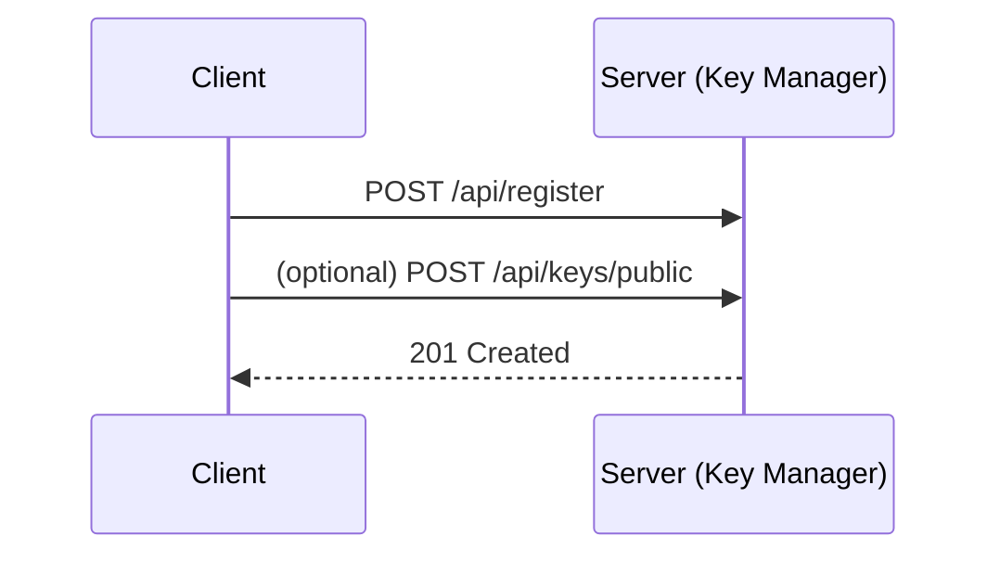
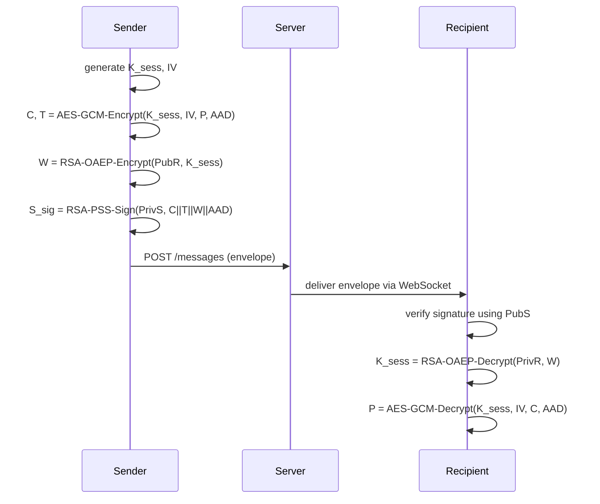

# SecureChat — Architecture and Design

Reference: [`ARCHITECTURE.md`](ARCHITECTURE.md:1)

## Overview

SecureChat is a web-based secure messaging application written in Python. It provides end-to-end confidentiality and authentication using AES-256-GCM for message encryption, RSA-OAEP to protect session keys during key exchange, and RSA-PSS for message signing.

The system includes:
- Frontend: browser-based UI (chat, key management, attack lab demos).
- Backend: REST APIs and WebSocket server for real-time messaging.
- Crypto layer: canonical implementations for encryption, signing, and key wrapping.
- Key Manager: handles persistent RSA keypairs and ephemeral session keys.
- Attack Lab: intentionally vulnerable and defended demos for Replay, Tampering, MITM, and DoS.

## Component Boundaries

Components (logical):
- Frontend (frontend/): static assets and templates. Responsible for UI, client-side crypto helpers (optional), and interacting with REST/WebSocket.
- Backend REST API (backend/api/routes.py): user management, key upload/download, message history.
- Backend WebSocket (backend/api/websocket.py): real-time messaging transport with per-connection authentication.
- Crypto primitives (backend/crypto/): server-side implementations of AES-GCM, RSA key handling, OAEP wrapping, and PSS signatures.
- Key Manager (backend/services/key_manager.py): persistent RSA key storage, key import/export, session key lifecycle.
- Attack Lab (attack_lab/): demos and services to exercise and demonstrate attacks and defenses.
- Middleware (backend/middleware/): rate limiting, connection controls, logging.

Deployment boundary:
- Trusted server components: backend services and persistent key storage (protected by server-side access controls).
- Untrusted clients: browsers; client-side crypto optional but the design assumes server-side cryptographic operations for demonstration and testing unless explicitly using WebCrypto.

## High-level Data Flows

The following subsections describe canonical flows. Sequence diagrams are provided in textual step-by-step form; mermaid diagrams are included where helpful.

### 1) User Registration and RSA Keypair Generation

Steps:
1. User registers via POST /api/register with username/password (or OIDC in future).
2. Server creates a user record with metadata; server may optionally generate an RSA keypair or accept client-generated keys.
3. If server generates keys: key_manager persists private RSA key encrypted at rest (see Key Lifecycle) and stores public key in user profile.
4. If client generates keys: client uploads public key via POST /api/keys/public and exports an encrypted private key backup via POST /api/keys/backup.

Mermaid:



### 2) Session Key Generation and Message Send (E2E sending with server-assisted key wrap)

Goal: Sender S wants to send plaintext P to recipient R with confidentiality, integrity, and authentication.

Steps (detailed):
1. Sender obtains recipient's public RSA key PubR from server via GET /api/keys/{recipient}.
2. Sender generates ephemeral AES-256-GCM session key K_sess (random 32 bytes) and a per-message nonce/IV (12 bytes recommended).
3. Sender encrypts the plaintext P using AES-256-GCM with K_sess and IV => ciphertext C and tag T.
4. Sender constructs a metadata object M = {sender_id, recipient_id, timestamp, iv, aad_version, other_metadata} and computes AAD = canonicalize(M).
5. Sender re-encrypts or signs metadata as needed; AES-GCM will authenticate AAD as associated data during encryption.
6. Sender encrypts (wraps) K_sess using recipient's RSA public key PubR with RSA-OAEP (SHA-256) => wrapped_key W.
7. Sender computes signature S_sig = RSA-PSS-Sign(PrivS, digest(C || T || W || canonical(M))).
8. Sender sends an envelope to the server via WebSocket or POST /api/messages:
   - envelope = {wrapped_key: base64(W), ciphertext: base64(C), tag: base64(T), metadata: M, signature: base64(S_sig), sender_pub: base64(PubS) or sender_id}.
9. Server stores envelope and forwards to recipient over WebSocket.

Sequence (mermaid):



Notes:
- Timestamp and message sequence numbers in metadata enable replay protection.
- AAD must include immutable fields used in signature to bind metadata to ciphertext.

### 3) Message Receive and Verification

Steps:
1. Recipient receives envelope.
2. Recipient verifies S_sig using sender's public key PubS obtained from server or included in envelope.
3. If signature verification fails, message is rejected and logged as tampering.
4. Recipient unwraps K_sess with RSA-OAEP using their private RSA key PrivR.
5. Recipient decrypts using AES-256-GCM with IV and AAD; verify tag T. If tag mismatch, treat as tampering.
6. Recipient checks metadata timestamp/sequence number to detect replays; if replay detected, reject and record.

## Crypto Primitives Rationale and Parameters

AES-256-GCM
- Mode: AEAD providing confidentiality and integrity.
- Key size: 256 bits (32 bytes).
- IV/nonce: 96-bit (12 bytes) per-message unique random nonce. Never reuse IV+key pair.
- Tag size: 128-bit (recommended) and enforced by implementation.
- AAD: canonical JSON of metadata (sender, recipient, timestamp, seq).
- Implementation: use Python cryptography library (cryptography.io) primitives in backend/crypto/aes_gcm.py.

RSA-OAEP
- Purpose: wrap (encrypt) ephemeral AES session keys for recipient.
- Padding: OAEP with SHA-256 as hash and MGF1 with SHA-256.
- Key sizes: 2048 or 3072 bits supported; recommend 3072 for higher security.
- Label: empty by default.
- Implementation: backend/crypto/rsa_oaep.py

RSA-PSS
- Purpose: provide non-repudiable signatures on message envelopes.
- Padding: PSS with MGF1(SHA-256), salt length = SHA-256 digest size (32 bytes) or max salt.
- Hash: SHA-256.
- Key sizes: 2048 minimum; 3072 recommended.
- Implementation: backend/crypto/rsa_pss.py

Randomness
- Use OS CSPRNG for AES keys and IVs (os.urandom or cryptography.hazmat.primitives).

## Key Lifecycle and Storage Policy

RSA Keypairs (user persistent keys)
- Generation: generated either client-side (preferred) or server-side (if user requests).
- Storage:
  - Private key persistence: encrypted at rest using server master key (K_master) stored in HSM or environment-provided secret; use AES-256-GCM for private key encryption.
  - Private keys are only decrypted into memory when performing server-side unwrap/sign operations; avoid writing clear-text private keys to disk.
  - Export/Import: PKCS#8 PEM encrypted with password-based encryption (PBKDF2-HMAC-SHA256 + AES-256-GCM).
- Rotation: support key rotation by creating new keypair and publishing new public key with versioning.
- Revocation: maintain revocation list and key version metadata; clients should fetch latest public key version.

Ephemeral Session Keys (AES session keys)
- Lifetime: per-message or per-conversation ephemeral; default per-message (generate new K_sess per message).
- Storage: in-memory only on sender and recipient while decrypting/processing; never persisted.
- Reuse policy: do not reuse IV under same key; prefer random IV per message.

Server Master Key (K_master)
- Used only to encrypt persisted private keys and backups.
- Storage: environment secret or HSM; never checked into repo.

Backup/Export format
- Private keys exported as encrypted PKCS#8 PEM with metadata JSON: {user_id, key_id, created_at, version}.

## API and WebSocket Contract

Provide endpoints and message formats. All REST endpoints are under /api/.

REST endpoints (examples)
- POST /api/register
  - body: {username, password}
- POST /api/login
  - body: {username, password}
  - response: {token: JWT}
- GET /api/keys/{user_id}
  - response: {user_id, public_key_pem, key_version, alg}
- POST /api/keys/public
  - body: {public_key_pem, key_version}
- POST /api/keys/backup
  - body: {encrypted_private_key_pem, metadata}
- POST /api/messages
  - body: envelope (see example below)
- GET /api/messages/{conversation_id}
  - response: array of envelopes

WebSocket contract
- Endpoint: /ws (authenticated via same JWT token passed as query or in subprotocol)
- After connect: client must send an "auth" frame: {type: "auth", token: "<JWT>"} before any other frames.
- Message frame types:
  - send_message: {type:"send", envelope: {...}}
  - ack: {type:"ack", message_id: "..."}
  - delivered: {type:"delivered", message_id: "..."}

Encrypted+Signed envelope format (JSON example)

```json
{
  "message_id": "uuid-v4",
  "sender_id": "alice",
  "recipient_id": "bob",
  "wrapped_key": "base64(W)",
  "ciphertext": "base64(C)",
  "tag": "base64(T)",
  "iv": "base64(IV)",
  "metadata": {
    "timestamp": "2025-12-06T18:00:00Z",
    "seq": 123,
    "aad_version": "1"
  },
  "signature": "base64(S_sig)",
  "sender_pub": "-----BEGIN PUBLIC KEY-----...-----END PUBLIC KEY-----"
}
```

Notes:
- All binary fields are base64-encoded.
- metadata is canonicalized (sorted keys, deterministic serialization) before being used as AAD and in signature digest.

## Threat Model and Mappings

Scope: network attackers, malicious server operator, compromised client device, and resource-exhaustion DoS actors. Trust anchors: users' private RSA keys and the server master key.

Threats:
1) Replay Attacks
   - Vector: captured envelope resent to recipient to duplicate or replay actions.
   - Affected properties: integrity (operation replay), availability (flood), authentication (if sequence accepted).
   - Mitigations:
     - Include timestamp and sequence numbers in metadata; recipient enforces monotonic sequence per sender-recipient pair.
     - Store recent message IDs and timestamps to detect duplicates.
     - Envelope signatures include metadata so replayed copies with altered metadata fail signature verification.

2) Ciphertext Tampering
   - Vector: attacker flips bits in ciphertext or modifies wrapped_key.
   - Affected properties: integrity and confidentiality.
   - Mitigations:
     - AES-GCM provides tag verification; any modification causes decryption failure.
     - RSA-PSS signature covers ciphertext, wrapped_key, and canonical metadata. Tampering causes signature verification failure.

3) Man-in-the-Middle (MITM)
   - Vector: attacker substitutes public keys or intercepts traffic.
   - Affected properties: confidentiality, authentication.
   - Mitigations:
     - Public keys are fetched from server; to avoid server-as-MITM, clients should support manual key verification (Key Management UI) and key fingerprint verification out-of-band.
     - Signed key directories and key versioning allow detection of sudden key changes; clients warn on key rotation.
     - Optional: Transparency logs for public keys (audit trail).

4) Denial-of-Service (DoS)
   - Vector: connection spamming, large payloads, expensive crypto ops (e.g., signature verifications), resource storms.
   - Affected properties: availability.
   - Mitigations:
     - Rate limiting middleware per IP and per account (backend/middleware/rate_limiter.py).
     - Connection limits and WebSocket heartbeats; limit concurrent connections per user.
     - Request size limits and enforce payload size caps.
     - Cheap pre-validation (e.g., check JWT, message size, known sender before expensive RSA ops); apply computational puzzles for suspicious clients.

## Attack Lab Design

Purpose: Provide educational demos showing how each attack works and how defenses mitigate them. Each demo has two variants: vulnerable and defended.

Directory mapping: attack_lab/ contains four subdirectories replay, tampering, mitm, dos. Each has three files: attack.py, defense.py, demo.py already present in repository.

For each demo, implement:
- attack.py: contains code that simulates the attacker behavior.
- defense.py: contains code that demonstrates the defended behavior (e.g., check signatures, enforce sequence numbers).
- demo.py: small web route or CLI that ties the pieces together to show attack/vs/defense.

Replay demo
- Vulnerable variant (attack_lab/replay/attack.py): server or forwarder accepts messages without sequence/timestamp checks. Attack script captures an envelope and re-sends it multiple times.
- Defended variant (attack_lab/replay/defense.py): server enforces per-conversation sequence numbers and rejects duplicates; demo shows rejected messages.
- Demo route: attack_lab/replay/demo.py

Tampering demo
- Vulnerable: attacker modifies ciphertext or wrapped_key before delivery; server forwards modified envelope without verifying signature.
- Defended: server verifies envelope signature before forwarding or recipient verifies on receipt and flags tampering. Files:
  - attack_lab/tampering/attack.py
  - attack_lab/tampering/defense.py
  - attack_lab/tampering/demo.py

MITM demo
- Vulnerable: attacker substitutes public key served by GET /api/keys/{user} and relays messages, allowing decryption (simulated by server that holds fake keys).
- Defended: key verification workflow and key-version warnings; demo shows manual fingerprint verification using frontend UI.
- Files:
  - attack_lab/mitm/attack.py
  - attack_lab/mitm/defense.py
  - attack_lab/mitm/demo.py

DoS demo
- Vulnerable: server accepts unlimited connections and performs expensive crypto for unauthenticated requests; attack script opens many WebSocket connections and posts large messages.
- Defended: rate limiting, connection quotas, and quick-validation to reject unauthenticated/oversized frames.
- Files:
  - attack_lab/dos/attack.py
  - attack_lab/dos/defense.py
  - attack_lab/dos/demo.py

Implementation notes:
- Demos should be isolated behind /attack_lab routes and require an "attack lab" flag or environment variable to enable in production.
- Each demo will return clear status messages and include expected outcomes for the user to observe.

## Rate-limiting and DoS Mitigation Design

Backend middleware responsibilities (backend/middleware/rate_limiter.py):
- Token-bucket per IP and per authenticated user.
- Global connection caps and per-user WebSocket connection limits.
- Message quotas per minute and per conversation.
- Fast-path checks: validate JWT and sender metadata before performing heavy crypto (signature verification and RSA decryption).
- Adaptive throttling: escalate limits for suspicious behavior (increase cost via puzzles or delay responses).

WebSocket-specific:
- heartbeat/ping intervals, close idle connections after timeout.
- backpressure: limit outgoing queue per connection; drop oldest messages for misbehaving clients.

## Testing Strategy

Unit tests
- crypto: test AES-GCM encrypt/decrypt cycles, tampering detection, IV uniqueness, tag correctness (tests/test_crypto.py).
- RSA: test OAEP wrap/unwrap, PSS sign/verify with 2048 and 3072 keys (tests/test_crypto.py or tests/test_key_manager.py).
- key manager: persist/restore encrypted private keys, rotation, export/import (tests/test_key_manager.py).

Integration tests
- end-to-end message flow: sender -> server -> recipient with signature verification and decryption (tests/test_integration.py).
- WebSocket flows: auth handshake, send/receive, ack behavior (tests/test_api.py).

Attack Lab tests (automated)
- Use tests/test_attack_lab.py to simulate attacks and verify vulnerable code allows attack and defended code blocks attack.

Manual test steps (Attack Lab)
- Replay:
  1. Start demo in vulnerable mode. Send a message from A to B.
  2. Use attack_lab/replay/attack.py to capture and re-send the envelope multiple times.
  3. Observe duplicate messages in B's chat. Expected: duplicates appear.
  4. Start defended mode. Repeat. Expected: additional retries are rejected and logs show replay detection.

- Tampering:
  1. Vulnerable: modify ciphertext before delivery; B either crashes or displays error on decrypt.
  2. Defended: tampered message rejected due to signature or tag mismatch; attack script logs detection.

- MITM:
  1. Vulnerable: replace public key and relay messages. Attacker demonstrates decryption or undetected substitution.
  2. Defended: client alerts on key fingerprint mismatch and refuses to send until user confirms.

- DoS:
  1. Vulnerable: run many connections/large messages and observe service degradation.
  2. Defended: server enforces rate limits and drops connections; service remains available for honest users.

Concrete test cases (examples)
- TC1: AES tag mismatch detection
  - Steps: tamper a ciphertext byte, attempt decrypt.
  - Expected: decryption fails, log entry created, client notified.

- TC2: Signature verification
  - Steps: modify signature field, attempt verify.
  - Expected: verification fails and message rejected.

- TC3: Key substitution detection
  - Steps: server returns new public key without version change; client should warn.
  - Expected: client shows key change alert and requires manual verification.

## File / Implementation Plan

The following files should be created or extended. Paths are relative to project root.

- backend/crypto/aes_gcm.py — implement AES-256-GCM wrapper with canonical AAD handling, strict IV handling, and utilities for base64 encode/decode.
- backend/crypto/rsa_oaep.py — RSA-OAEP wrap/unwrap utilities (SHA-256).
- backend/crypto/rsa_pss.py — RSA-PSS sign/verify utilities (SHA-256).
- backend/crypto/rsa_keys.py — key generation, load/save, PEM handling, encrypted PKCS#8 export/import.
- backend/services/key_manager.py — persist RSA private keys encrypted with server master key, key rotation and versioning API.
- backend/api/routes.py — add endpoints for key upload/download, message POST, and message history retrieval.
- backend/api/websocket.py — WebSocket auth handshake, message routing, and pre-validation hooks.
- backend/middleware/rate_limiter.py — implement token-bucket rate limiting, connection quotas.
- backend/services/attack_lab.py — glue code to run demos in attack_lab/ per configuration.
- attack_lab/*/attack.py, defense.py, demo.py — refine to match behavior described above (already present; update as needed).
- frontend/static/js/crypto.js — helper functions to call WebCrypto APIs if client-side crypto is enabled; base64 helpers.
- frontend/templates/attack_lab.html — UI to select demos and view results.
- tests/test_crypto.py — expand to cover AES-GCM edge cases and RSA operations.
- docs/TECHNICAL_REPORT.md — cross-reference cryptographic choices and tests (optional).

Minimal new files if server-side-only crypto is used are listed above. If adding client-side crypto, add key import/export UI code.

## Acceptance Criteria

The subtask is complete when:
- [`ARCHITECTURE.md`](ARCHITECTURE.md:1) exists and contains the sections described in the scope (system overview, data flows, crypto rationale, key lifecycle, API/WebSocket contract, threat model with mitigations, Attack Lab mapping, rate-limiting design, testing strategy, file plan, acceptance criteria).
- Attack Lab mapping references the existing files under attack_lab/ as specified.
- File/implementation plan lists concrete files (paths) that will be created or modified.
- Test cases and manual steps for Attack Lab are included.
- The document includes example payloads and diagrams (textual or mermaid).

## Appendix — Example payloads and attack payloads

Normal encrypted and signed payload (compact, base64 fields):

```json
{
  "message_id": "123e4567-e89b-12d3-a456-426614174000",
  "sender_id": "alice",
  "recipient_id": "bob",
  "wrapped_key": "MII...base64...",
  "ciphertext": "q1d2...base64...",
  "tag": "AABB...base64...",
  "iv": "r3n...base64...",
  "metadata": {"timestamp":"2025-12-06T18:00:00Z","seq":42},
  "signature": "c0mPresS...base64"
}
```

Replay attack payload
- Replay is simply re-sending an existing envelope; the attack script will post the same JSON multiple times.

Tampering attack payload
- Flip a byte in ciphertext or replace wrapped_key with a random base64 string:

```json
{
  "message_id": "123e4567-e89b-12d3-a456-426614174000",
  "ciphertext": "q1d2...tampered-bytes...",
  "wrapped_key": "AAAA...not-a-valid-wrapped-key..."
}
```

MITM attack scenario (public key substitution)
- Attacker replaces server-provided public key for Bob with their own PubM, receives wrapped keys W by being addressed as recipient, unwraps K_sess, and forwards re-wrapped K_sess to Bob using Bob's real key to avoid detection if server doesn't bind signatures to public keys.

DoS attack scenario
- Attack script opens many WebSocket connections each sending large payloads to exhaust CPU/memory. Defended server will limit connections and drop or challenge high-cost requests.

## Operational Notes

- Enable HTTPS/TLS for all server endpoints; certificate management is outside the scope of this doc but required.
- Logging and monitoring should capture security events (failed signature verifications, repeated replays, rate-limit triggers).
- Attack Lab must be disabled in production via configuration flag in config.py.

## Contact and References

- Cryptography primitives and guidance: NIST SP 800-38D (GCM), PKCS #1, RFC 8017 (PSS/OAEP), and OWASP cheat sheets.

End of document.