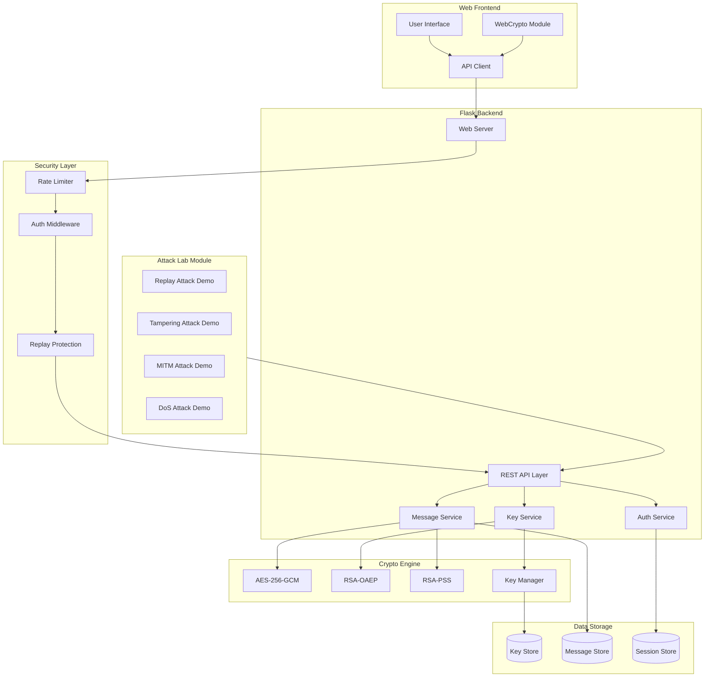
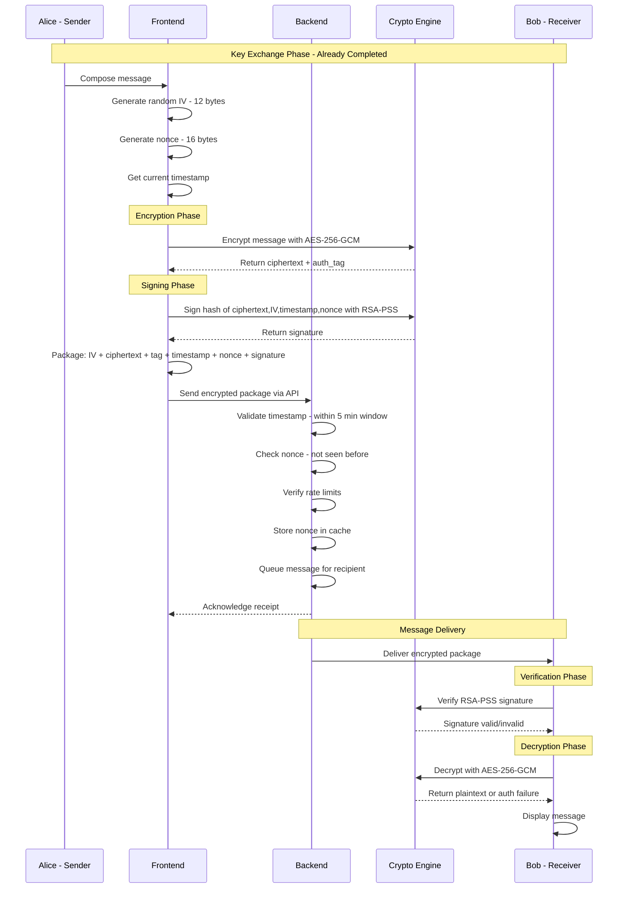
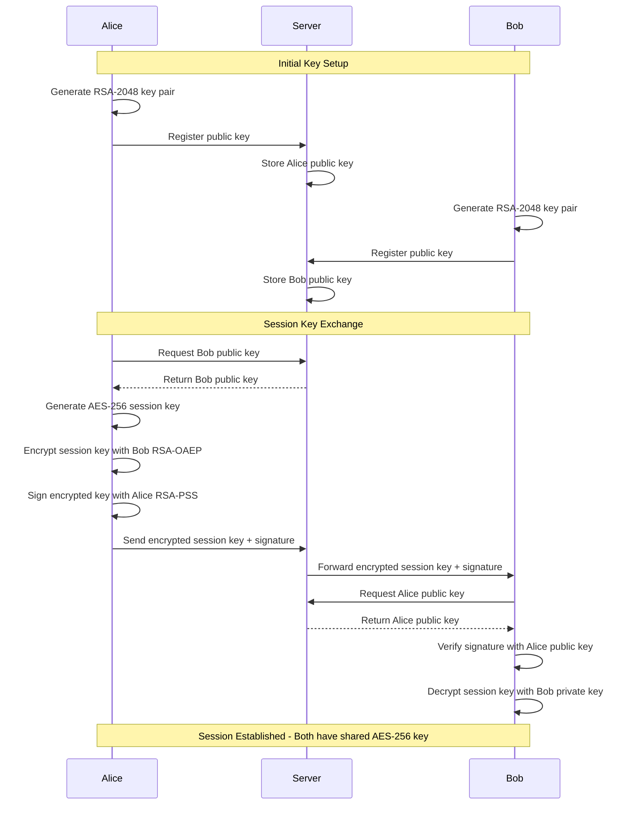
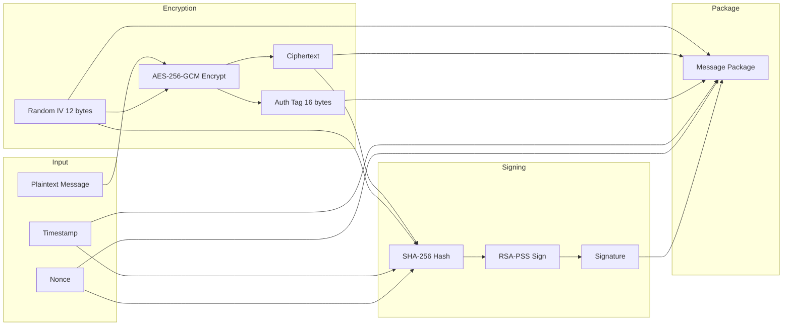
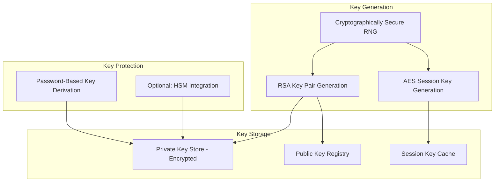
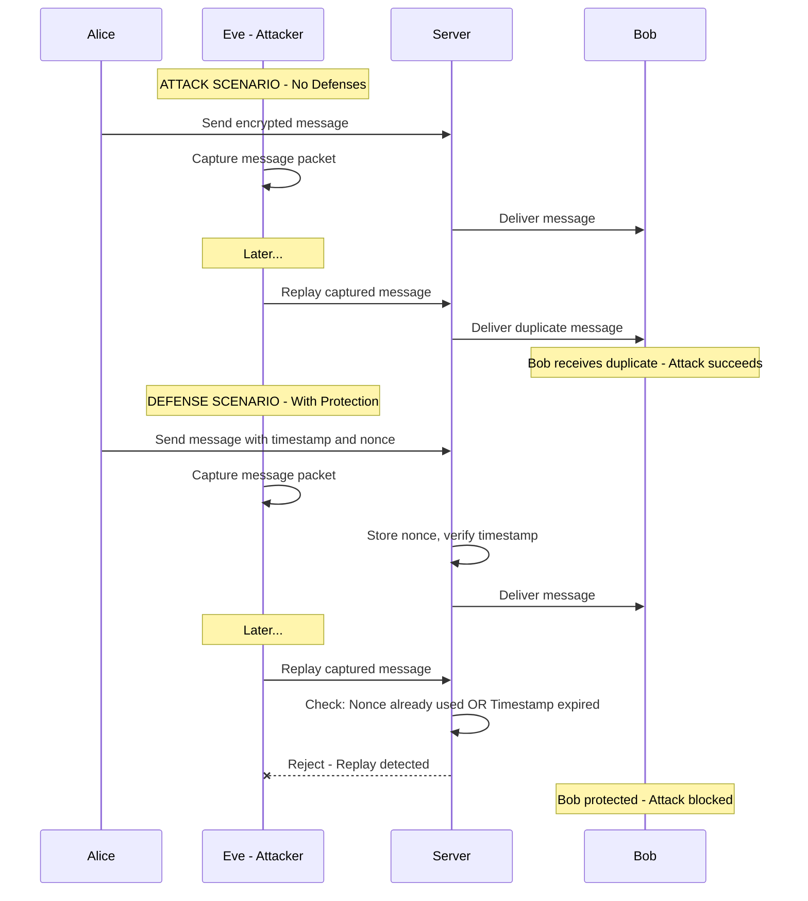
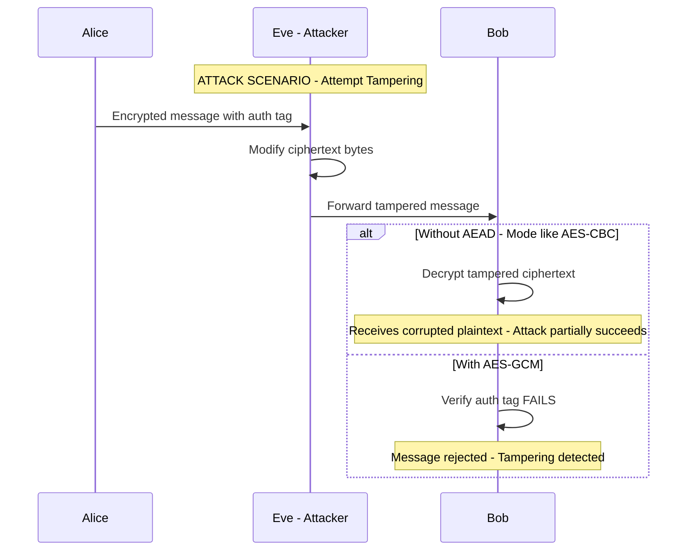
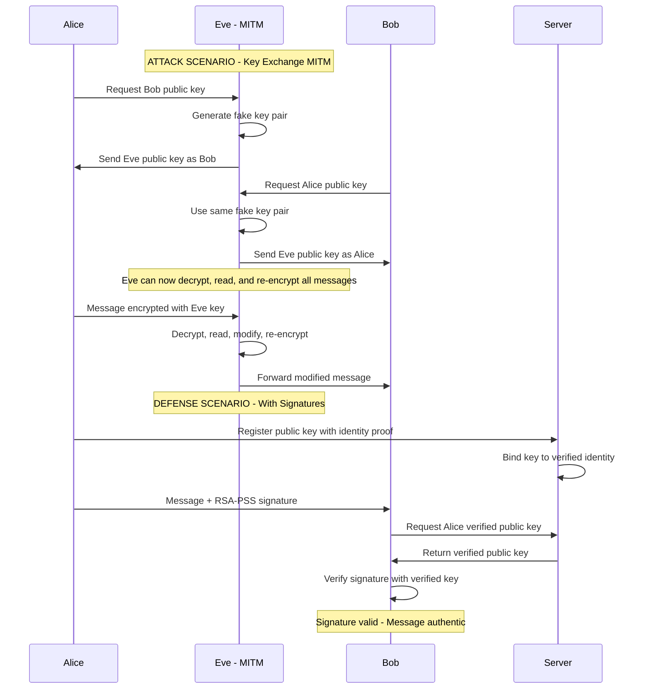
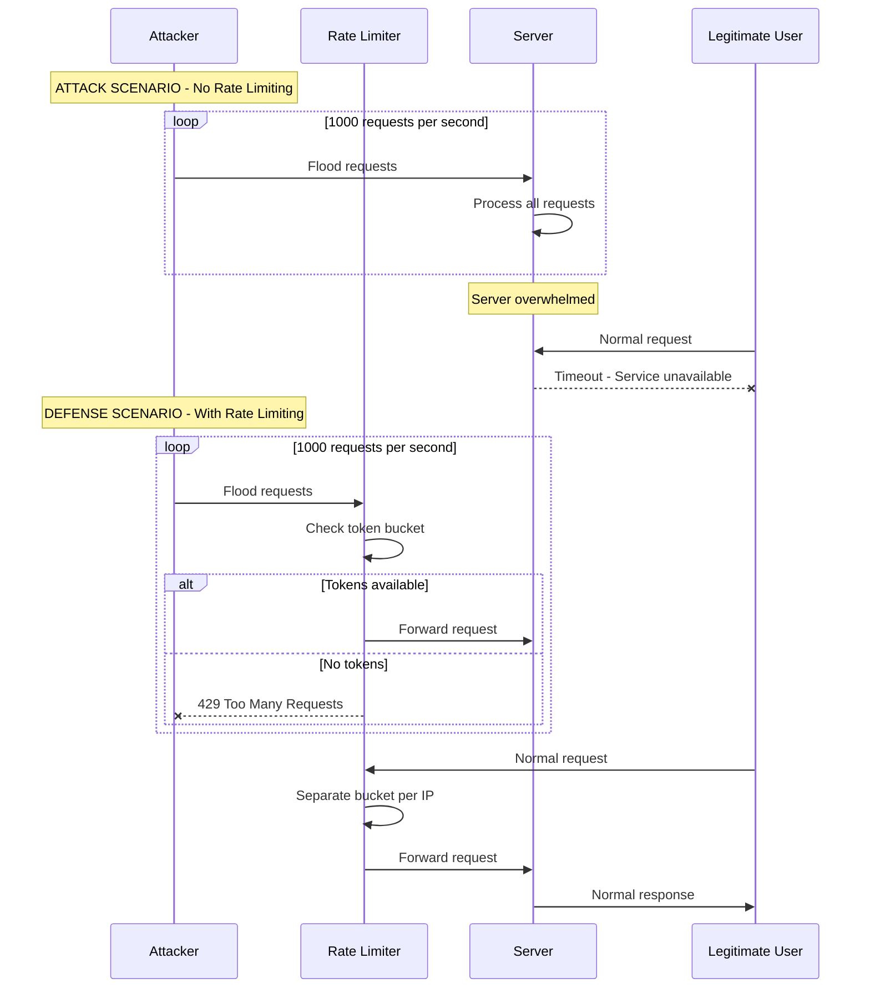

# SecureChat Architecture Document

## Overview

SecureChat is a web-based secure messaging application that implements end-to-end encryption using industry-standard cryptographic primitives. This document describes the complete architecture, including the security model, component design, and the Attack Lab for demonstrating both vulnerabilities and defenses.

---

## Table of Contents

1. [Project Folder Structure](#1-project-folder-structure)
2. [Component Architecture](#2-component-architecture)
3. [Data Flow](#3-data-flow)
4. [Security Architecture](#4-security-architecture)
5. [Technology Stack](#5-technology-stack)
6. [Attack Lab Design](#6-attack-lab-design)
7. [Message Protocol Specification](#7-message-protocol-specification)
8. [API Endpoints](#8-api-endpoints)

---

## 1. Project Folder Structure

```
SecureChat/
├── README.md                          # Project overview and quick start
├── ARCHITECTURE.md                    # This document
├── requirements.txt                   # Python dependencies
├── config.py                          # Application configuration
├── run.py                             # Application entry point
│
├── backend/                           # Flask backend application
│   ├── __init__.py                    # Flask app factory
│   ├── app.py                         # Main application setup
│   ├── config.py                      # Backend configuration
│   │
│   ├── api/                           # REST API endpoints
│   │   ├── __init__.py
│   │   ├── routes.py                  # API route definitions
│   │   ├── auth.py                    # Authentication endpoints
│   │   ├── messages.py                # Message handling endpoints
│   │   └── keys.py                    # Key exchange endpoints
│   │
│   ├── crypto/                        # Cryptographic modules
│   │   ├── __init__.py
│   │   ├── aes_gcm.py                 # AES-256-GCM encryption/decryption
│   │   ├── rsa_oaep.py                # RSA-OAEP key wrapping
│   │   ├── rsa_pss.py                 # RSA-PSS signing/verification
│   │   ├── key_manager.py             # Key generation and storage
│   │   └── utils.py                   # Cryptographic utilities
│   │
│   ├── models/                        # Data models
│   │   ├── __init__.py
│   │   ├── user.py                    # User model
│   │   ├── message.py                 # Message model
│   │   └── session.py                 # Session model
│   │
│   ├── services/                      # Business logic services
│   │   ├── __init__.py
│   │   ├── message_service.py         # Message processing service
│   │   ├── auth_service.py            # Authentication service
│   │   └── key_service.py             # Key management service
│   │
│   └── middleware/                    # Request middleware
│       ├── __init__.py
│       ├── rate_limiter.py            # DoS protection
│       ├── replay_protection.py       # Replay attack protection
│       └── auth_middleware.py         # Authentication middleware
│
├── frontend/                          # Web frontend
│   ├── static/                        # Static assets
│   │   ├── css/
│   │   │   ├── main.css               # Main stylesheet
│   │   │   └── chat.css               # Chat-specific styles
│   │   │
│   │   ├── js/
│   │   │   ├── app.js                 # Main application logic
│   │   │   ├── crypto.js              # Client-side crypto (WebCrypto API)
│   │   │   ├── chat.js                # Chat functionality
│   │   │   ├── api.js                 # API client
│   │   │   └── utils.js               # Utility functions
│   │   │
│   │   └── images/                    # Image assets
│   │       └── logo.png
│   │
│   └── templates/                     # Jinja2 HTML templates
│       ├── base.html                  # Base template
│       ├── index.html                 # Landing page
│       ├── login.html                 # Login page
│       ├── register.html              # Registration page
│       ├── chat.html                  # Main chat interface
│       └── attack_lab.html            # Attack Lab interface
│
├── attack_lab/                        # Attack demonstrations
│   ├── __init__.py
│   ├── README.md                      # Attack Lab documentation
│   │
│   ├── replay_attack/                 # Replay Attack demonstration
│   │   ├── __init__.py
│   │   ├── attack.py                  # Attack implementation
│   │   ├── defense.py                 # Defense implementation
│   │   └── demo.py                    # Interactive demo
│   │
│   ├── tampering_attack/              # Ciphertext Tampering demonstration
│   │   ├── __init__.py
│   │   ├── attack.py                  # Attack implementation
│   │   ├── defense.py                 # Defense implementation
│   │   └── demo.py                    # Interactive demo
│   │
│   ├── mitm_attack/                   # Man-in-the-Middle demonstration
│   │   ├── __init__.py
│   │   ├── attack.py                  # Attack implementation
│   │   ├── defense.py                 # Defense implementation
│   │   └── demo.py                    # Interactive demo
│   │
│   └── dos_attack/                    # Denial of Service demonstration
│       ├── __init__.py
│       ├── attack.py                  # Attack implementation
│       ├── defense.py                 # Defense implementation
│       └── demo.py                    # Interactive demo
│
├── tests/                             # Test suite
│   ├── __init__.py
│   ├── conftest.py                    # Pytest configuration
│   │
│   ├── unit/                          # Unit tests
│   │   ├── __init__.py
│   │   ├── test_aes_gcm.py            # AES-GCM tests
│   │   ├── test_rsa_oaep.py           # RSA-OAEP tests
│   │   ├── test_rsa_pss.py            # RSA-PSS tests
│   │   └── test_key_manager.py        # Key manager tests
│   │
│   ├── integration/                   # Integration tests
│   │   ├── __init__.py
│   │   ├── test_message_flow.py       # End-to-end message tests
│   │   ├── test_key_exchange.py       # Key exchange tests
│   │   └── test_api.py                # API endpoint tests
│   │
│   └── security/                      # Security tests
│       ├── __init__.py
│       ├── test_replay_protection.py  # Replay protection tests
│       ├── test_tampering_detection.py # Tampering detection tests
│       ├── test_mitm_protection.py    # MITM protection tests
│       └── test_dos_protection.py     # DoS protection tests
│
├── docs/                              # Documentation
│   ├── TECHNICAL_REPORT.md            # Technical report
│   ├── USER_GUIDE.md                  # User guide
│   ├── API_DOCUMENTATION.md           # API documentation
│   └── ATTACK_LAB_GUIDE.md            # Attack Lab guide
│
├── scripts/                           # Utility scripts
│   ├── setup.sh                       # Setup script (Unix)
│   ├── setup.bat                      # Setup script (Windows)
│   ├── generate_keys.py               # Key generation utility
│   └── demo_attacks.py                # Attack demonstration script
│
└── data/                              # Runtime data (gitignored)
    ├── keys/                          # Stored keys
    ├── sessions/                      # Session data
    └── logs/                          # Application logs
```

---

## 2. Component Architecture

### 2.1 High-Level Component Diagram



### 2.2 Component Descriptions

| Component | Responsibility |
|-----------|----------------|
| **Web Server** | Flask application server handling HTTP requests and WebSocket connections |
| **REST API Layer** | Exposes endpoints for authentication, messaging, and key exchange |
| **Message Service** | Handles message encryption, decryption, signing, and verification |
| **Auth Service** | Manages user authentication and session management |
| **Key Service** | Handles key generation, exchange, and storage |
| **AES-256-GCM** | Symmetric encryption for message content with authenticated encryption |
| **RSA-OAEP** | Asymmetric encryption for protecting session keys |
| **RSA-PSS** | Digital signatures for message authentication and integrity |
| **Key Manager** | Generates, stores, and manages cryptographic keys |
| **Rate Limiter** | Protects against DoS attacks by limiting request rates |
| **Replay Protection** | Detects and blocks replayed messages using nonces and timestamps |
| **Auth Middleware** | Validates authentication tokens and user sessions |
| **Attack Lab Module** | Interactive demonstrations of attacks and defenses |

---

## 3. Data Flow

### 3.1 Message Sending Flow



### 3.2 Key Exchange Flow



### 3.3 Data Flow Diagram



---

## 4. Security Architecture

### 4.1 Cryptographic Specifications

| Component | Algorithm | Key Size | Notes |
|-----------|-----------|----------|-------|
| **Symmetric Encryption** | AES-256-GCM | 256 bits | AEAD with 128-bit auth tag |
| **Asymmetric Encryption** | RSA-OAEP | 2048 bits | SHA-256 for OAEP padding |
| **Digital Signatures** | RSA-PSS | 2048 bits | SHA-256 with MGF1 |
| **IV Generation** | CSPRNG | 96 bits | Unique per message |
| **Nonce Generation** | CSPRNG | 128 bits | For replay protection |

### 4.2 Key Generation and Storage



**Key Storage Strategy:**

1. **Private Keys**: Stored encrypted using PBKDF2-derived key from user password
2. **Public Keys**: Stored in server registry, associated with user identity
3. **Session Keys**: Kept in memory, expire after configurable timeout (default: 1 hour)
4. **Key Rotation**: Support for periodic key rotation without message loss

### 4.3 Message Format Specification

```
+------------------+------------------+------------------+
|     HEADER       |      BODY        |    TRAILER       |
+------------------+------------------+------------------+
| Version (1 byte) | IV (12 bytes)    | Signature        |
| Flags (1 byte)   | Ciphertext (var) | (256 bytes)      |
| Timestamp (8 b)  | Auth Tag (16 b)  |                  |
| Nonce (16 bytes) |                  |                  |
| Sender ID (32 b) |                  |                  |
+------------------+------------------+------------------+

Total Header: 58 bytes
Signature: 256 bytes (RSA-2048)
Minimum Message Size: 58 + 16 + 256 = 330 bytes
```

**Field Descriptions:**

| Field | Size | Description |
|-------|------|-------------|
| Version | 1 byte | Protocol version (current: 0x01) |
| Flags | 1 byte | Message flags (encrypted, signed, etc.) |
| Timestamp | 8 bytes | Unix timestamp in milliseconds |
| Nonce | 16 bytes | Random nonce for replay protection |
| Sender ID | 32 bytes | SHA-256 hash of sender's public key |
| IV | 12 bytes | Initialization vector for AES-GCM |
| Ciphertext | Variable | Encrypted message content |
| Auth Tag | 16 bytes | GCM authentication tag |
| Signature | 256 bytes | RSA-PSS signature over header + body |

### 4.4 Defense Mechanisms

#### Defense Matrix

| Attack Type | Defense Mechanism | Implementation |
|-------------|-------------------|----------------|
| **Replay Attack** | Timestamp + Nonce | 5-minute window, nonce cache with TTL |
| **Ciphertext Tampering** | AES-GCM Auth Tag | 128-bit authentication tag validation |
| **MITM Attack** | RSA-PSS Signatures | Public key verification, certificate pinning |
| **DoS Attack** | Rate Limiting | Token bucket algorithm, connection limits |

---

## 5. Technology Stack

### 5.1 Backend Stack

| Component | Technology | Version | Purpose |
|-----------|------------|---------|---------|
| **Web Framework** | Flask | 3.0+ | Lightweight web framework |
| **Cryptography** | cryptography | 41.0+ | Cryptographic primitives |
| **WebSockets** | Flask-SocketIO | 5.3+ | Real-time messaging |
| **Rate Limiting** | Flask-Limiter | 3.5+ | DoS protection |
| **CORS** | Flask-CORS | 4.0+ | Cross-origin resource sharing |
| **Validation** | marshmallow | 3.20+ | Request/response validation |

### 5.2 Frontend Stack

| Component | Technology | Purpose |
|-----------|------------|---------|
| **UI Framework** | Vanilla JavaScript | Minimal dependencies |
| **Crypto API** | WebCrypto API | Client-side cryptography |
| **Styling** | CSS3 | Modern styling |
| **HTTP Client** | Fetch API | API communication |
| **WebSocket** | Socket.IO Client | Real-time messaging |

### 5.3 Development Tools

| Tool | Purpose |
|------|---------|
| **pytest** | Testing framework |
| **black** | Code formatting |
| **flake8** | Linting |
| **mypy** | Type checking |
| **coverage** | Code coverage |

### 5.4 Python Dependencies

```
# requirements.txt
flask>=3.0.0
flask-socketio>=5.3.0
flask-limiter>=3.5.0
flask-cors>=4.0.0
cryptography>=41.0.0
marshmallow>=3.20.0
python-dotenv>=1.0.0
redis>=5.0.0
gunicorn>=21.0.0
pytest>=7.4.0
pytest-cov>=4.1.0
black>=23.0.0
flake8>=6.1.0
mypy>=1.5.0
```

---

## 6. Attack Lab Design

The Attack Lab provides interactive demonstrations of each security vulnerability and its corresponding defense. Each attack module follows a consistent structure:

1. **Educational Overview**: Explanation of the attack
2. **Vulnerable Mode**: Demonstrate the attack succeeding
3. **Defended Mode**: Show the defense preventing the attack
4. **Comparison**: Side-by-side analysis

### 6.1 Replay Attack Lab

**Objective**: Demonstrate how an attacker can capture and resend valid encrypted messages.



**Implementation Details:**

```python
# Vulnerable mode - no replay protection
def send_message_vulnerable(message, session_key):
    iv = os.urandom(12)
    ciphertext = aes_gcm_encrypt(message, session_key, iv)
    return {"iv": iv, "ciphertext": ciphertext}

# Defended mode - with replay protection
def send_message_defended(message, session_key):
    iv = os.urandom(12)
    timestamp = int(time.time() * 1000)
    nonce = os.urandom(16)
    ciphertext = aes_gcm_encrypt(message, session_key, iv)
    signature = rsa_pss_sign(ciphertext + iv + timestamp + nonce)
    return {
        "iv": iv,
        "ciphertext": ciphertext,
        "timestamp": timestamp,
        "nonce": nonce,
        "signature": signature
    }
```

### 6.2 Ciphertext Tampering Attack Lab

**Objective**: Demonstrate how AES-GCM authentication tags detect modifications.



**Implementation Details:**

```python
# Attack demonstration
def tampering_attack_demo():
    # Original encryption
    plaintext = b"Transfer $100 to Bob"
    key = os.urandom(32)
    iv = os.urandom(12)
    ciphertext, tag = aes_gcm_encrypt(plaintext, key, iv)
    
    # Attacker tampers with ciphertext
    tampered_ciphertext = bytearray(ciphertext)
    tampered_ciphertext[10] ^= 0xFF  # Flip bits
    
    # Decryption attempt
    try:
        result = aes_gcm_decrypt(bytes(tampered_ciphertext), key, iv, tag)
        return "VULNERABLE: Decryption succeeded with tampered data"
    except InvalidTag:
        return "DEFENDED: Tampering detected - authentication failed"
```

### 6.3 Man-in-the-Middle Attack Lab

**Objective**: Demonstrate how an attacker can intercept and modify communications without signature verification.



**Implementation Details:**

```python
# Vulnerable mode - no signature verification
def key_exchange_vulnerable(peer_public_key):
    session_key = os.urandom(32)
    encrypted_key = rsa_oaep_encrypt(session_key, peer_public_key)
    return encrypted_key  # No way to verify peer identity

# Defended mode - with signature verification
def key_exchange_defended(peer_public_key, peer_signature, trusted_keys):
    # Verify the public key is from trusted source
    if not verify_key_ownership(peer_public_key, peer_signature, trusted_keys):
        raise SecurityError("Public key verification failed")
    
    session_key = os.urandom(32)
    encrypted_key = rsa_oaep_encrypt(session_key, peer_public_key)
    signature = rsa_pss_sign(encrypted_key, own_private_key)
    return {"encrypted_key": encrypted_key, "signature": signature}
```

### 6.4 Denial of Service Attack Lab

**Objective**: Demonstrate how rate limiting prevents resource exhaustion.



**Implementation Details:**

```python
# Rate limiting configuration
RATE_LIMITS = {
    "messages": "30 per minute",
    "key_exchange": "5 per minute", 
    "login_attempts": "5 per minute",
    "api_general": "100 per minute"
}

# Token bucket implementation
class RateLimiter:
    def __init__(self, rate, capacity):
        self.rate = rate
        self.capacity = capacity
        self.tokens = capacity
        self.last_update = time.time()
    
    def allow_request(self):
        now = time.time()
        elapsed = now - self.last_update
        self.tokens = min(self.capacity, self.tokens + elapsed * self.rate)
        self.last_update = now
        
        if self.tokens >= 1:
            self.tokens -= 1
            return True
        return False
```

### 6.5 Attack Lab UI Design

```
+----------------------------------------------------------+
|                    SecureChat Attack Lab                  |
+----------------------------------------------------------+
|  [Replay Attack] [Tampering] [MITM] [DoS]                |
+----------------------------------------------------------+
|                                                          |
|  +------------------------+  +------------------------+  |
|  |    VULNERABLE MODE     |  |    DEFENDED MODE       |  |
|  +------------------------+  +------------------------+  |
|  |                        |  |                        |  |
|  | [Start Attack Demo]    |  | [Start Defense Demo]   |  |
|  |                        |  |                        |  |
|  | Status: Ready          |  | Status: Ready          |  |
|  |                        |  |                        |  |
|  | Log:                   |  | Log:                   |  |
|  | > Capturing message... |  | > Message received     |  |
|  | > Replaying message... |  | > Checking timestamp   |  |
|  | > Message accepted!    |  | > Checking nonce       |  |
|  | > ATTACK SUCCEEDED     |  | > Replay detected!     |  |
|  |                        |  | > ATTACK BLOCKED       |  |
|  +------------------------+  +------------------------+  |
|                                                          |
|  +----------------------------------------------------+  |
|  |                   EXPLANATION                       |  |
|  +----------------------------------------------------+  |
|  | Replay attacks capture valid encrypted messages    |  |
|  | and resend them later. Without timestamp and       |  |
|  | nonce validation, the server cannot distinguish    |  |
|  | between original and replayed messages.            |  |
|  +----------------------------------------------------+  |
+----------------------------------------------------------+
```

---

## 7. Message Protocol Specification

### 7.1 Protocol Version 1.0

```
Message Structure:
==================

Byte Offset | Field        | Size    | Description
------------|--------------|---------|----------------------------------
0           | version      | 1       | Protocol version (0x01)
1           | flags        | 1       | Bit flags for message options
2-9         | timestamp    | 8       | Unix timestamp (milliseconds)
10-25       | nonce        | 16      | Random nonce for replay protection
26-57       | sender_id    | 32      | SHA-256 of sender's public key
58-69       | iv           | 12      | AES-GCM initialization vector
70-N        | ciphertext   | var     | Encrypted message content
N+1-N+16    | auth_tag     | 16      | AES-GCM authentication tag
N+17-N+272  | signature    | 256     | RSA-PSS signature

Flags (byte 1):
===============
Bit 0: Encrypted (1 = yes)
Bit 1: Signed (1 = yes)
Bit 2: Compressed (1 = yes)
Bit 3: Key exchange message (1 = yes)
Bits 4-7: Reserved
```

### 7.2 Signature Coverage

The RSA-PSS signature covers:
1. Version
2. Flags
3. Timestamp
4. Nonce
5. Sender ID
6. IV
7. Ciphertext
8. Auth Tag

This ensures complete message integrity and authentication.

---

## 8. API Endpoints

### 8.1 Authentication Endpoints

| Method | Endpoint | Description |
|--------|----------|-------------|
| POST | `/api/auth/register` | Register new user with public key |
| POST | `/api/auth/login` | Authenticate user |
| POST | `/api/auth/logout` | End session |
| GET | `/api/auth/session` | Get current session info |

### 8.2 Key Management Endpoints

| Method | Endpoint | Description |
|--------|----------|-------------|
| GET | `/api/keys/public/:user_id` | Get user's public key |
| POST | `/api/keys/exchange` | Initiate key exchange |
| POST | `/api/keys/session` | Exchange session key |
| DELETE | `/api/keys/session/:session_id` | Revoke session key |

### 8.3 Messaging Endpoints

| Method | Endpoint | Description |
|--------|----------|-------------|
| POST | `/api/messages/send` | Send encrypted message |
| GET | `/api/messages/receive` | Get pending messages |
| GET | `/api/messages/history/:peer_id` | Get message history |
| DELETE | `/api/messages/:message_id` | Delete message |

### 8.4 Attack Lab Endpoints

| Method | Endpoint | Description |
|--------|----------|-------------|
| GET | `/api/lab/status` | Get attack lab status |
| POST | `/api/lab/replay/vulnerable` | Demo replay without defense |
| POST | `/api/lab/replay/defended` | Demo replay with defense |
| POST | `/api/lab/tampering/vulnerable` | Demo tampering without defense |
| POST | `/api/lab/tampering/defended` | Demo tampering with defense |
| POST | `/api/lab/mitm/vulnerable` | Demo MITM without defense |
| POST | `/api/lab/mitm/defended` | Demo MITM with defense |
| POST | `/api/lab/dos/vulnerable` | Demo DoS without defense |
| POST | `/api/lab/dos/defended` | Demo DoS with defense |

---

## 9. Implementation Priorities

### Phase 1: Core Infrastructure
1. Project setup and dependencies
2. Basic Flask application structure
3. Database models and storage

### Phase 2: Cryptographic Engine
1. AES-256-GCM encryption/decryption
2. RSA-OAEP key wrapping
3. RSA-PSS signing/verification
4. Key management system

### Phase 3: Messaging System
1. Message protocol implementation
2. REST API endpoints
3. WebSocket integration for real-time messaging

### Phase 4: Security Defenses
1. Replay protection (timestamp + nonce)
2. Rate limiting
3. Authentication middleware

### Phase 5: Attack Lab
1. Replay attack demonstration
2. Tampering attack demonstration
3. MITM attack demonstration
4. DoS attack demonstration

### Phase 6: Frontend
1. User interface design
2. Client-side cryptography (WebCrypto)
3. Attack Lab UI

### Phase 7: Testing & Documentation
1. Unit tests
2. Integration tests
3. Security tests
4. Documentation

---

## 10. Security Considerations

### 10.1 Threat Model

**Assets to Protect:**
- Message confidentiality
- Message integrity
- User authentication
- Service availability

**Threat Actors:**
- Passive eavesdroppers (network sniffers)
- Active attackers (message manipulation)
- Malicious users (DoS attempts)
- Man-in-the-middle attackers

### 10.2 Security Guarantees

| Property | Mechanism | Guarantee |
|----------|-----------|-----------|
| **Confidentiality** | AES-256-GCM | Messages unreadable without key |
| **Integrity** | GCM Auth Tag + RSA-PSS | Tampering detection |
| **Authentication** | RSA-PSS Signatures | Sender verification |
| **Freshness** | Timestamp + Nonce | Replay prevention |
| **Availability** | Rate Limiting | DoS mitigation |

### 10.3 Known Limitations

1. **No Forward Secrecy**: Session keys protect messages; compromise of session key reveals session messages
2. **Trust in Server**: Server sees encrypted messages and metadata
3. **Key Management**: Users responsible for protecting private keys
4. **No Deniability**: Signatures provide non-repudiation

---

## Appendix A: Cryptographic Code Examples

### AES-256-GCM Encryption

```python
from cryptography.hazmat.primitives.ciphers.aead import AESGCM
import os

def encrypt_message(plaintext: bytes, key: bytes) -> tuple[bytes, bytes, bytes]:
    """
    Encrypt a message using AES-256-GCM.
    
    Returns: (iv, ciphertext, tag)
    """
    iv = os.urandom(12)  # 96-bit IV
    aesgcm = AESGCM(key)
    ciphertext_with_tag = aesgcm.encrypt(iv, plaintext, None)
    # GCM appends 16-byte tag to ciphertext
    ciphertext = ciphertext_with_tag[:-16]
    tag = ciphertext_with_tag[-16:]
    return iv, ciphertext, tag

def decrypt_message(iv: bytes, ciphertext: bytes, tag: bytes, key: bytes) -> bytes:
    """
    Decrypt a message using AES-256-GCM.
    
    Raises InvalidTag if authentication fails.
    """
    aesgcm = AESGCM(key)
    ciphertext_with_tag = ciphertext + tag
    return aesgcm.decrypt(iv, ciphertext_with_tag, None)
```

### RSA-PSS Signing

```python
from cryptography.hazmat.primitives import hashes
from cryptography.hazmat.primitives.asymmetric import padding, rsa

def sign_message(message: bytes, private_key: rsa.RSAPrivateKey) -> bytes:
    """
    Sign a message using RSA-PSS with SHA-256.
    """
    signature = private_key.sign(
        message,
        padding.PSS(
            mgf=padding.MGF1(hashes.SHA256()),
            salt_length=padding.PSS.MAX_LENGTH
        ),
        hashes.SHA256()
    )
    return signature

def verify_signature(message: bytes, signature: bytes, public_key: rsa.RSAPublicKey) -> bool:
    """
    Verify an RSA-PSS signature.
    """
    try:
        public_key.verify(
            signature,
            message,
            padding.PSS(
                mgf=padding.MGF1(hashes.SHA256()),
                salt_length=padding.PSS.MAX_LENGTH
            ),
            hashes.SHA256()
        )
        return True
    except InvalidSignature:
        return False
```

### RSA-OAEP Key Wrapping

```python
from cryptography.hazmat.primitives.asymmetric import padding

def wrap_session_key(session_key: bytes, public_key: rsa.RSAPublicKey) -> bytes:
    """
    Wrap a session key using RSA-OAEP.
    """
    encrypted_key = public_key.encrypt(
        session_key,
        padding.OAEP(
            mgf=padding.MGF1(algorithm=hashes.SHA256()),
            algorithm=hashes.SHA256(),
            label=None
        )
    )
    return encrypted_key

def unwrap_session_key(encrypted_key: bytes, private_key: rsa.RSAPrivateKey) -> bytes:
    """
    Unwrap a session key using RSA-OAEP.
    """
    session_key = private_key.decrypt(
        encrypted_key,
        padding.OAEP(
            mgf=padding.MGF1(algorithm=hashes.SHA256()),
            algorithm=hashes.SHA256(),
            label=None
        )
    )
    return session_key
```

---

## Appendix B: Message Format Examples

### Encrypted Message (Hex Dump)

```
00000000: 01 03 00 00 01 8C 5A 2B  C8 00 A1 B2 C3 D4 E5 F6  ......Z+........
00000010: 01 02 03 04 05 06 07 08  09 0A 0B 0C 0D 0E 0F 10  ................
00000020: [32 bytes sender_id...]                           
00000040: [12 bytes IV...]
00000050: [Variable length ciphertext...]
000000XX: [16 bytes auth tag...]
000000YY: [256 bytes RSA-PSS signature...]

Fields:
- Byte 0: Version = 0x01
- Byte 1: Flags = 0x03 (encrypted + signed)
- Bytes 2-9: Timestamp
- Bytes 10-25: Nonce
- Bytes 26-57: Sender ID
- Bytes 58-69: IV
- Bytes 70-N: Ciphertext
- Bytes N+1 to N+16: Auth Tag
- Bytes N+17 to N+272: Signature
```

---

*Document Version: 1.0*
*Last Updated: December 2024*
*Project: SecureChat - ICS344 Security Project*